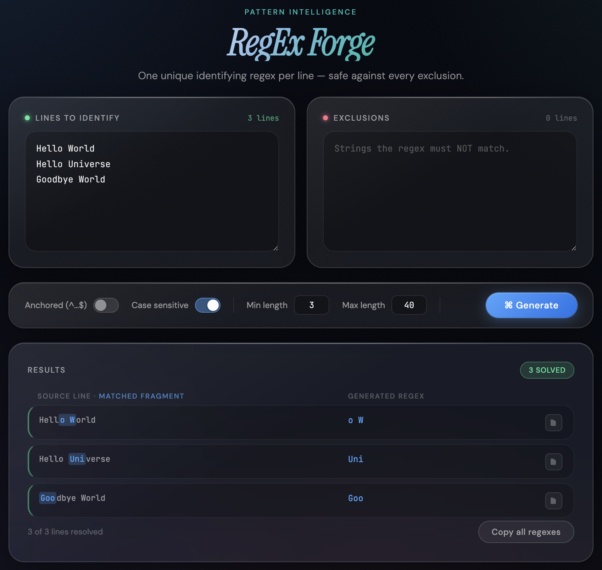

# RegEx Forge

A beautiful, single-page web application that generates unique regular expressions for each line of input text. The generated regex patterns are guaranteed to match only their intended target while excluding any specified exclusion strings.



## Features

- **Unique Pattern Generation**: Generates the shortest unique regex pattern for each input line
- **Exclusion Support**: Ensures generated patterns don't match any strings in the exclusion list
- **Smart Scoring**: Prefers shorter patterns, word-aligned boundaries, and cleaner matches
- **Customizable Options**:
  - Anchored patterns (`^...$`) for exact matching
  - Case-sensitive or case-insensitive matching
  - Configurable minimum and maximum pattern lengths
- **Modern UI**: Beautiful glassmorphism design with smooth animations
- **Copy to Clipboard**: Copy individual regexes or all at once
- **Keyboard Shortcut**: Press `Cmd/Ctrl + Enter` to generate patterns

## How It Works

The algorithm finds the shortest substring for each whitelist line that:

1. Does NOT appear in any exclusion (blacklist) entry
2. Does NOT appear in any OTHER whitelist line

This guarantees that each generated regex uniquely identifies its target line.

### Scoring System

Candidates are scored based on:
- **Length**: Shorter patterns are preferred
- **Word boundaries**: Patterns starting/ending at word boundaries get bonus points
- **Mid-word splits**: Patterns that split words receive penalties

## Usage

1. Open [`index.html`](index.html) in any modern web browser
2. Enter the strings you want to identify (one per line) in the **"Lines to Identify"** panel
3. Optionally, enter strings that must NOT be matched in the **"Exclusions"** panel
4. Configure options as needed:
   - **Anchored**: Wrap pattern in `^...$` for exact line matching
   - **Case sensitive**: Enable/disable case-sensitive matching
   - **Min/Max length**: Set pattern length constraints
5. Click **Generate** or press `Cmd/Ctrl + Enter`
6. Copy individual regexes using the copy button, or copy all at once

## Example

**Input (Lines to Identify):**
```
Hello World
Hello Universe
Goodbye World
```

**Generated Regexes:**
```
o W
Uni
Goo
```


Each regex uniquely identifies its corresponding line without matching the others.

## Technical Details

- **Pure HTML/CSS/JavaScript**: No external dependencies required
- **Single File**: Everything is contained in [`index.html`](index.html)
- **Modern CSS Features**: Uses CSS variables, glassmorphism, backdrop-filter
- **Responsive Design**: Works on desktop and mobile devices
- **Fonts**: Uses Google Fonts (Instrument Serif, JetBrains Mono, DM Sans)

## Browser Support

Requires a modern browser with support for:
- CSS Backdrop Filter
- CSS Grid
- ES6+ JavaScript
- Clipboard API

Works in Chrome, Firefox, Safari, and Edge (latest versions).

## Algorithm Complexity

For each line of length `n`, the algorithm checks all substrings from `minLen` to `maxLen`:
- Time complexity: O(n² × m) where m is the total length of all exclusion strings
- Space complexity: O(n) for storing candidates

## License

MIT License - feel free to use and modify as needed.

## Contributing

Contributions are welcome! Feel free to:
- Report bugs
- Suggest new features
- Submit pull requests

---

Built with ❤️ for developers who work with regular expressions
